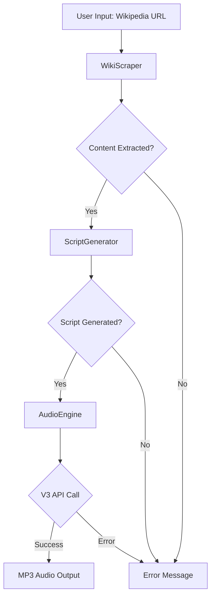
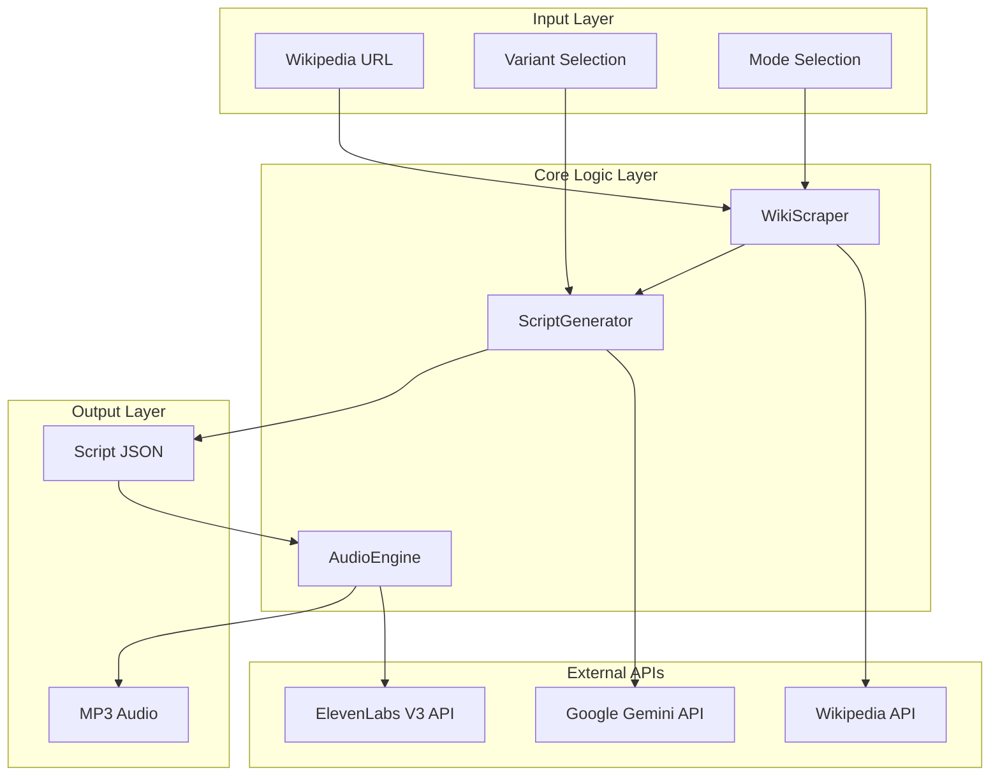
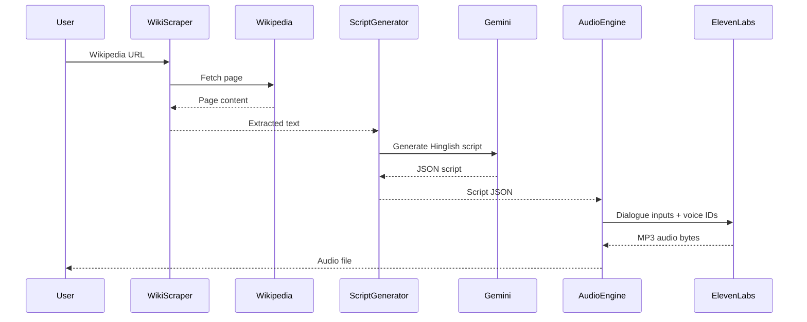

# The Synthetic Radio Host - Wiki-talks - Technical Design Document

## Project Overview

**Project Name**: The Synthetic Radio Host - Wiki-talks  
**Hackathon**: Winter 30  
**Track**: AI/ML  
**Submission Date**: January 2026

### Problem Statement

Create a Python pipeline that generates natural-sounding 2-minute Hinglish radio conversations from Wikipedia articles, ensuring the audio sounds conversational (not robotic) with interruptions, filler words, and natural flow.

### Solution Overview

The Synthetic Radio Host - Wiki-talks uses a three-stage pipeline:
1. **Wikipedia Scraping**: Extract content from Wikipedia articles with error handling
2. **Script Generation**: Use Google Gemini to create Hinglish conversation scripts following V3 audio rules
3. **Audio Synthesis**: Use ElevenLabs V3 text-to-dialogue API to generate natural conversation audio

## System Architecture

### High-Level Architecture



### Component Architecture



## Detailed Component Design

### 1. WikiScraper

**Purpose**: Extract content from Wikipedia articles with robust error handling

**Key Features**:
- Handles DisambiguationError (auto-selects first option)
- Handles PageError gracefully
- Fast mode: Summary only
- Pro mode: Sections (capped at 4000 words)

**Methods**:
- `scrape(url, mode)`: Main scraping method
- `_extract_title_from_url(url)`: Extract page title from URL
- `_extract_sections(page, max_words)`: Extract sections with word limit

**Error Handling**:
- Invalid URLs return None with error message
- Non-existent pages return None with error message
- Disambiguation pages auto-select first option

### 2. ScriptGenerator

**Purpose**: Generate Hinglish conversation scripts using Google Gemini

**Key Features**:
- Uses Gemini 1.5 Flash model
- JSON response format (strict)
- V3 audio tag support
- Target duration calculation (~300 words for 2 minutes)

**V3 Audio Rules**:
1. NO SSML tags (`<break>`, `<prosody>`)
2. Audio tags: `[laughs]`, `[sighs]`, `[whispers]`, `[clears throat]`, `[gasps]`
3. Punctuation: `...` for hesitation
4. CAPS for emphasis: `"Arre BAS! Stop it!"`
5. Interruptions: End line with `-`, next starts with `[fast]`

**Methods**:
- `generate_script(text, variant, duration)`: Generate script from content
- `_strip_markdown(text)`: Remove markdown code fences

**Output Format**:
```json
[
  {"speaker": "Host", "text": "Achcha, so Mumbai Indians..."},
  {"speaker": "Guest", "text": "Haan bhai, amazing team!"}
]
```

### 3. AudioEngine

**Purpose**: Generate audio using ElevenLabs V3 text-to-dialogue endpoint

**Key Features**:
- Single API call for entire conversation
- Automatic conversation flow handling
- Voice mapping (Host/Guest)
- Configurable endpoint URL

**Methods**:
- `generate_dialogue_v3(script_json, api_key, base_url)`: Generate audio from script

**API Request Structure**:
```json
{
  "inputs": [
    {"text": "...", "voice_id": "..."},
    {"text": "...", "voice_id": "..."}
  ],
  "model_id": "eleven_v3"
}
```

## Data Flow

### Complete Pipeline Flow



## Configuration

### Variants

Three conversation styles with distinct system prompts:

1. **RJ**: Casual, engaging radio host style
2. **Business**: Professional business discussion
3. **Teams**: Sports/team-focused energetic conversation

### Voice Mapping

```python
VOICE_CAST = {
    "Host": "voice_id_1",
    "Guest": "voice_id_2"
}
```

### API Endpoints

- Default: `https://api.elevenlabs.io/v1/text-to-dialogue`
- Alternative: `https://api.in.residency.elevenlabs.io/v1/text-to-dialogue`

## V3 vs Previous Approach

### Previous Approach (Not Used)
- Individual TTS calls per speaker line
- Manual audio stitching with pydub
- Complex interruption handling
- Manual timing and gap insertion

### V3 Approach (Current)
- Single API call for entire conversation
- Automatic conversation flow
- Natural interruptions handled by API
- No manual audio processing required

**Benefits**:
- Simpler codebase (no pydub dependency)
- Better conversation flow
- Natural timing and pauses
- Reduced complexity

## Error Handling Strategy

### Wikipedia Scraping
- Invalid URLs: Return None with friendly error
- Page not found: Return None with error message
- Disambiguation: Auto-select first option
- Empty content: Return None with error

### Script Generation
- JSON parsing errors: Strip markdown and retry
- Invalid structure: Validate and return error
- API failures: Return None with error message

### Audio Generation
- API errors: Return None with status code and message
- Network errors: Return None with network error message
- Invalid voice IDs: Return None with error message

## Testing Strategy

### Unit Tests
- `test_wikiscraper.py`: URL parsing, error handling, content extraction
- `test_scriptgenerator.py`: JSON generation, validation, V3 tag support
- `test_audioengine.py`: API call structure, voice mapping, error handling

### Test Coverage
- All error paths tested
- API calls mocked to avoid costs
- Edge cases covered (empty inputs, invalid data)

## Setup and Deployment

### Local Development

1. Install dependencies:
   ```bash
   pip install -r requirements.txt
   ```

2. Set API keys in environment or Streamlit secrets

3. Run Streamlit UI:
   ```bash
   streamlit run app.py
   ```

### Colab Deployment

1. Upload `colab_submission.py` and `core_logic.py` to Colab

2. Set API keys in Colab secrets:
   - Runtime > Manage secrets
   - Add `GEMINI_API_KEY` and `ELEVEN_API_KEY`

3. Run cells in order

### Production Considerations

- API key security (use secrets management)
- Rate limiting for API calls
- Error logging and monitoring
- Cost estimation and budgeting

## Assumptions and Constraints

### Assumptions
- Wikipedia articles are in English
- API keys are valid and have sufficient credits
- ElevenLabs Voice IDs are valid and support Hinglish
- Target duration is approximately 2 minutes

### Constraints
- Pro mode caps content at 4000 words
- Script targets ~300 words for 2 minutes
- V3 API has specific audio tag requirements
- No SSML tags allowed in V3

## Future Enhancements

- Support for multiple languages
- Custom voice selection UI
- Real-time generation progress
- Batch processing for multiple articles
- Audio quality options
- Script editing before audio generation

## Code Explanations

### Why V3 Dialogue API?

The V3 Dialogue API simplifies the entire audio generation process by handling conversation flow automatically. Instead of generating individual audio clips and manually stitching them, we make a single API call with the entire script, and the API handles:
- Natural conversation timing
- Interruption overlaps
- Pause insertion
- Voice transitions

### Why Hinglish?

Hinglish (Hindi-English code-switching) is natural for Indian radio conversations. The system prompts explicitly instruct the LLM to use natural filler words and code-switching patterns that sound authentic.

### Why Three Variants?

Different conversation contexts require different tones:
- **RJ**: Fun, casual, energetic
- **Business**: Professional, informative
- **Teams**: Passionate, sports-focused

Each variant has a tailored system prompt that guides the LLM to generate appropriate content.

## Conclusion

The Synthetic Radio Host - Wiki-talks demonstrates a complete pipeline from Wikipedia content to natural Hinglish audio conversations. The use of ElevenLabs V3 Dialogue API simplifies audio generation while maintaining high quality and natural flow. The modular architecture ensures maintainability and testability.

